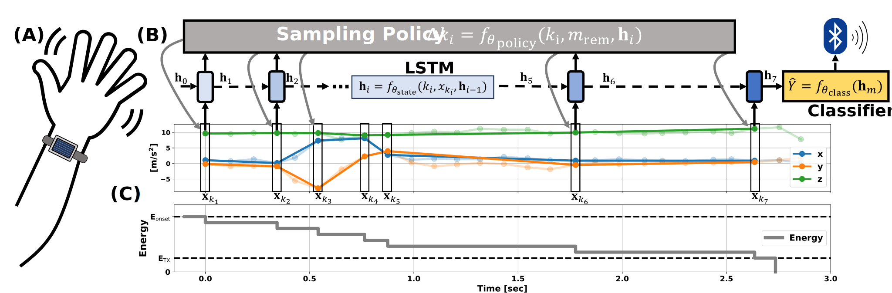

# Batteryless Gesture Recognition Via Learned Sampling
(IEEE BSN 2025) Batteryless Gesture Recognition Via Learned Sampling


# Environment Setup
```
conda create --name bgest python=3.10
conda activate bgest
```

Install the necessary packages 
```
pip install torch==2.2.0 torchvision==0.17.0 torchaudio==2.2.0 --index-url https://download.pytorch.org/whl/cu118
```

```
pip install -e .
```

# Directories
- ```datasets``` contains the raw data, a PyTorch dataset class, and preprocessing functions
- ```experiments``` contains the training functions for the classifier and policy and the training scripts for all settings
- ```models``` contains the augmented LSTM model
- ```utils``` contains miscillaneous helper functions
- ```saved_data``` is a folder that gets generated to store logs for all experiment outputs

# Execution Logic
- ```experiments/train_classifier.py``` and ```experiments/train_policy.py``` contain the main driver code. They train/validate the classifier baselines and learned policy via a Leave-One-Subject-Out-Cross-Validation (LOSOCV) loop.
- ```models/vrnn.py``` defines the augmented LSTM model that can execute by delaying time steps. Within the ```VRNN``` PyTorch model class, there is a function called ```other_forward()``` with a *SkipForward* execution mode that implements this functionality to use a policy to determine when to sample next.
- ```datasets/dataset.py``` contains a PyTorch dataset class which implements the ```__getitem__()``` function in a different way depending on the policy. For the *learned* policy, we use the ```find_best_skip()``` function to determine which delay is the best. This is used to train the policy.


# Train Baselines
```
./pretrain_smartwatch_gesture.sh
```

```
./pretrain_motion_gesture.sh
```

# Train Policy and Finetune Classifier
```
./learn_policy_smartwatch_gesture.sh
```

```
./learn_policy_motion_gesture.sh
```

# Visualize Results
```
viz_metrics.ipynb
```